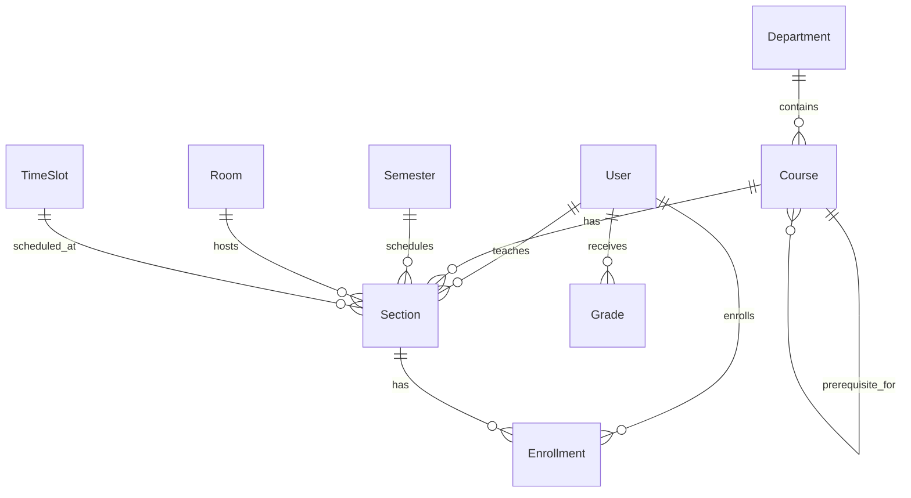

# University Scheduling System - Project Analysis

## 📋 Project Overview
A comprehensive university scheduling system built to automate course scheduling, handle room allocation, manage time slots, and track student enrollments with prerequisite validation.

**Tech Stack:**
- **Backend:** NestJS (Node.js framework)
- **Frontend:** Next.js 16 with React 19 (App Router)
- **Database:** PostgreSQL
- **ORM:** Prisma 7.3
- **Styling:** Tailwind CSS 4

---

## 🗂️ Current Project Structure

```
scheduling-system-fdb/
├── backend/
│   ├── src/
│   │   ├── app.module.ts       # Main NestJS module
│   │   ├── main.ts             # Entry point (Port 3000)
│   │   └── [controllers/services - TO BE ADDED]
│   ├── prisma/
│   │   └── schema.prisma       # ✅ Complete database schema
│   ├── .env                    # Database connection
│   └── package.json            # NestJS + Prisma dependencies
│
├── frontend/
│   ├── app/
│   │   ├── layout.tsx          # Root layout
│   │   └── page.tsx            # Home page (boilerplate)
│   ├── next.config.ts
│   └── package.json            # Next.js 16 + React 19
│
├── schema.sql                  # PostgreSQL schema (reference)
├── DESIGN_NOTES.md            # Feature specifications
└── scheduler.js               # Standalone scheduling logic
```

---

## ✅ What's Already Set Up

### 1. **Database Schema (Prisma)** ✅
**Location:** `backend/prisma/schema.prisma`

**Models Implemented:**
- ✅ **User** - Authentication with roles (admin, teacher, student)
- ✅ **Department** - Programs (e.g., Software Engineering)
- ✅ **Course** - Course catalog with prerequisites (self-relation)
- ✅ **Room** - Classrooms with capacity and type
- ✅ **TimeSlot** - Standardized time blocks with unique constraint
- ✅ **Semester** - Academic periods
- ✅ **Section** - Scheduled classes (courses + rooms + time slots)
- ✅ **Enrollment** - Student registrations
- ✅ **Grade** - Historical grades for prerequisite validation

**Key Features:**
- ✅ Self-referential prerequisites (Course → Course)
- ✅ Role-based access control (enum: admin/teacher/student)
- ✅ Unique constraints to prevent conflicts
- ✅ Proper foreign key relationships

### 2. **Backend (NestJS)** ⚠️
**Status:** Initialized but minimal

**What Exists:**
- ✅ Basic NestJS structure
- ✅ Prisma client setup
- ✅ Port configuration (3000)

**What's Missing:**
- ❌ Prisma module/service integration
- ❌ API controllers (departments, courses, sections, etc.)
- ❌ Authentication/authorization middleware
- ❌ Scheduling algorithm integration
- ❌ Validation pipes
- ❌ Error handling
- ❌ CORS configuration

### 3. **Frontend (Next.js)** ⚠️
**Status:** Boilerplate only

**What Exists:**
- ✅ Next.js 16 App Router
- ✅ TypeScript configuration
- ✅ Tailwind CSS 4 setup
- ✅ Modern fonts (Geist)

**What's Missing:**
- ❌ UI components for scheduling
- ❌ Admin dashboard
- ❌ Student portal
- ❌ Teacher interface
- ❌ API integration layer
- ❌ Authentication pages
- ❌ Calendar/timetable views

### 4. **Database Connection** ⚠️
**Status:** Prisma local dev database configured

**Current Setup:**
```
DATABASE_URL="prisma+postgres://localhost:51213/..."
```
- Using Prisma's local PostgreSQL server
- Needs migration to apply schema

---

## 🚨 Critical Issues to Address

### 1. **Database Migration Not Applied**
The Prisma schema exists but hasn't been migrated to the database.

**Action Required:**
```bash
cd backend
npx prisma migrate dev --name init
npx prisma generate
```

### 2. **No API Endpoints**
Backend has no controllers to handle:
- User management (CRUD)
- Course catalog management
- Section creation and scheduling
- Enrollment processing
- Grade submission

### 3. **No Authentication System**
- No JWT/session implementation
- No password hashing (bcrypt)
- No role-based guards

### 4. **Frontend Not Connected to Backend**
- No API client setup
- No environment variables for backend URL
- No state management

### 5. **Scheduling Algorithm Not Integrated**
- `scheduler.js` exists in root but not integrated
- Needs to be refactored as NestJS service

---

## 📊 Database Schema Analysis

### Entity Relationships



### Scheduling Constraints (From Schema)

**Hard Constraints:**
1. ✅ One room per time slot (via unique section assignment)
2. ✅ One teacher per time slot (foreign key to User)
3. ✅ Room capacity validation (maxCapacity field)
4. ✅ Prerequisites enforcement (Course.prerequisites relation)

**Soft Constraints (To Implement):**
- Teacher preferences (not in schema yet)
- Student batch conflicts (needs validation logic)
- Lab vs. Lecture room types (field exists, needs enforcement)

---

## 🎯 Recommended Implementation Steps

### Phase 1: Backend Foundation (Week 1)
1. **Setup Prisma Integration**
   - Create `PrismaModule` and `PrismaService`
   - Run migrations
   - Generate Prisma Client

2. **Authentication Module**
   - Install: `@nestjs/jwt`, `@nestjs/passport`, `bcrypt`
   - Implement user registration/login
   - Create role guards (Admin/Teacher/Student)

3. **Core CRUD Modules**
   - Departments Module
   - Courses Module (with prerequisites)
   - Rooms Module
   - TimeSlots Module
   - Semesters Module

### Phase 2: Scheduling Engine (Week 2)
1. **Sections Module**
   - Section creation
   - Teacher assignment
   - Manual scheduling (room + time slot)

2. **Auto-Scheduler Service**
   - Port `scheduler.js` logic to NestJS
   - Implement constraint checking
   - Conflict detection

3. **Enrollment Module**
   - Student registration
   - Prerequisite validation
   - Capacity checks

### Phase 3: Frontend Development (Week 3)
1. **Layout & Navigation**
   - Admin dashboard
   - Teacher portal
   - Student portal

2. **Scheduling UI**
   - Course catalog view
   - Timetable grid component
   - Drag-and-drop scheduling (optional)

3. **Forms & Validation**
   - Course creation
   - Section management
   - Student enrollment

### Phase 4: Advanced Features (Week 4)
1. **Retake Handling**
   - Calculate demand from grades
   - Suggest additional sections

2. **Reports & Analytics**
   - Room utilization
   - Teacher workload
   - Student progress

3. **Testing & Deployment**
   - Unit tests (Jest)
   - E2E tests (Supertest)
   - Docker setup (optional)

---

## 🔧 Immediate Setup Commands

### 1. Initialize Database
```bash
cd backend
npx prisma migrate dev --name init
npx prisma generate
npx prisma studio  # Optional: View database in browser
```

### 2. Install Missing Dependencies (Backend)
```bash
cd backend
npm install @nestjs/jwt @nestjs/passport passport passport-jwt bcrypt
npm install @nestjs/config class-validator class-transformer
npm install -D @types/bcrypt @types/passport-jwt
```

### 3. Install Missing Dependencies (Frontend)
```bash
cd frontend
npm install axios swr  # or react-query for API calls
npm install zustand    # Optional: State management
npm install date-fns   # Date utilities for scheduling
```

### 4. Test Current Setup
```bash
# Backend
cd backend
npm run start:dev  # Should start on http://localhost:3000

# Frontend (in new terminal)
cd frontend
npm run dev  # Should start on http://localhost:3001
```

---

## 📝 Key Design Decisions from DESIGN_NOTES.md

### 1. **Automation Engine**
**Goal:** Generate schedules automatically, not just store them

**Implementation Approach:**
- Input: Courses, Rooms, Teachers
- Logic: Constraint satisfaction problem (CSP)
- Output: Optimized schedule with minimal conflicts

### 2. **Retake Handling**
**Challenge:** Failed students increase course demand unexpectedly

**Solution:**
- Query `Grade` table for failed students
- Calculate: `Total Demand = Fresh Students + Retakes`
- Auto-suggest opening new sections if needed

### 3. **Constraint Types**
**Hard Constraints (Must Never Break):**
- Room conflicts
- Teacher conflicts
- Prerequisites not met

**Soft Constraints (Optimize):**
- Teacher time preferences
- Minimize student schedule gaps

---

## 🎨 Proposed UI Pages

### Admin Dashboard
- `/admin/dashboard` - Overview stats
- `/admin/courses` - Course catalog management
- `/admin/sections` - Section scheduling
- `/admin/rooms` - Room management
- `/admin/users` - User management
- `/admin/schedule` - Auto-scheduler interface

### Teacher Portal
- `/teacher/schedule` - My teaching schedule
- `/teacher/sections` - My sections & students
- `/teacher/grades` - Grade submission

### Student Portal
- `/student/schedule` - My timetable
- `/student/enrollment` - Course registration
- `/student/grades` - Grade history

---

## ⚠️ Potential Challenges

1. **Scheduling Complexity**
   - Combinatorial explosion with many courses/rooms
   - May need heuristic algorithms (not brute force)

2. **Concurrent Enrollments**
   - Race conditions when students enroll simultaneously
   - Need transaction locks or optimistic locking

3. **Prerequisite Chains**
   - Complex validation (A requires B, B requires C)
   - Need recursive checking

4. **Time Zone Handling**
   - Prisma `@db.Time` doesn't store time zones
   - All times should be in university's local time

5. **Room Type Matching**
   - Labs should only host lab courses
   - Need validation in scheduling logic

---

## 📈 Next Steps Checklist

- [ ] Run Prisma migrations
- [ ] Create PrismaModule in NestJS
- [ ] Set up authentication (JWT)
- [ ] Create first API endpoint (GET /courses)
- [ ] Test backend-frontend connection
- [ ] Design database seed script (sample data)
- [ ] Implement scheduling algorithm
- [ ] Build admin dashboard UI
- [ ] Add prerequisite validation
- [ ] Deploy to staging environment

---

## 📚 Useful Resources

- **Prisma Docs:** https://www.prisma.io/docs
- **NestJS Docs:** https://docs.nestjs.com
- **Next.js Docs:** https://nextjs.org/docs
- **Scheduling Algorithms:**
  - Constraint Satisfaction Problems (CSP)
  - Genetic Algorithms
  - Backtracking with pruning

---

## 🤝 Team Collaboration Tips

1. **Git Workflow:**
   - Main branch for stable code
   - Feature branches for new modules
   - Pull requests with code review

2. **API Documentation:**
   - Use Swagger/OpenAPI in NestJS
   - Install: `@nestjs/swagger`

3. **Environment Variables:**
   - Never commit `.env` files
   - Use `.env.example` as template

4. **Database Migrations:**
   - Always run migrations in order
   - Test migrations on development DB first

---

## 🎓 Project Strengths

✅ **Well-Designed Schema** - Covers all core requirements
✅ **Modern Tech Stack** - Industry-standard tools
✅ **Clear Documentation** - DESIGN_NOTES.md shows good planning
✅ **Scalable Architecture** - Monorepo with separate frontend/backend
✅ **Type Safety** - TypeScript + Prisma for end-to-end types

---

**Last Updated:** 2026-01-28
**Status:** Setup Phase (20% Complete)
